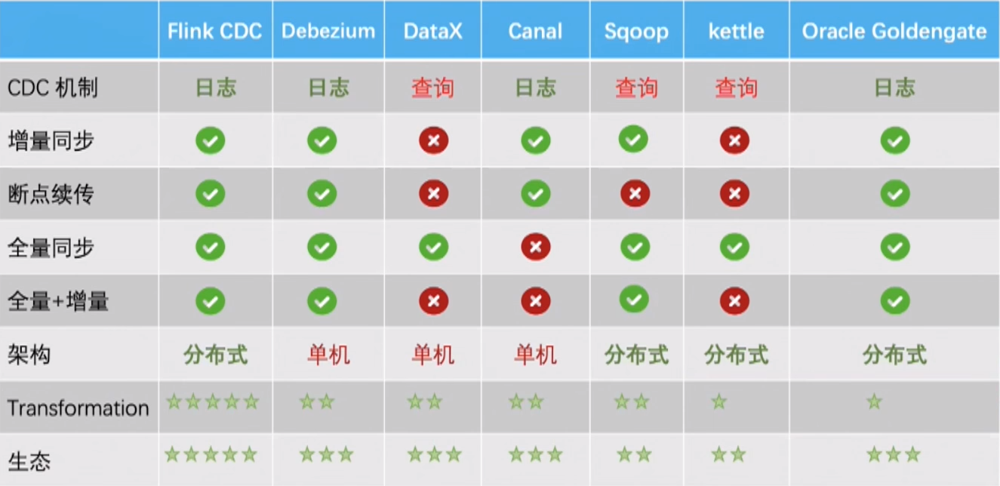

# CDC的实现方式

## 基于查询的CDC

* 离线调度查询作业，批处理
* 无法保障数据一致性
* 不保障实时性

## 基于日志的CDC

* 实时消费日志，流式处理
* 保障数据一致性
* 提供实时数据

# 集成进入Springboot

按常理来说,一个正常的 flink-job 最终我们并不会集成到 springboot 项目中，我们会直接编写一个 maven 项目，在发布时使用 flink 程序来启动任务。

但是现在要进行改造，就是不要将这个 flink-cdc 作为一个 job 使用 flink 程序进行发布提交，我们就当它在我们开发时一样，作为一个本地项目， main 方法启动。

实现 ApplicationRunner 将flink-cdc 作为一个项目启动时需要运行的分支子任务即可